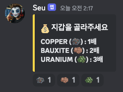
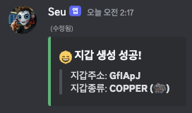
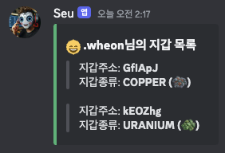
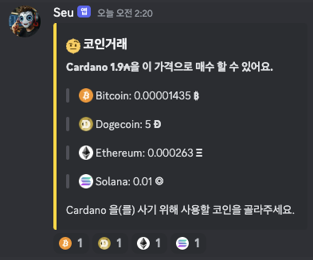
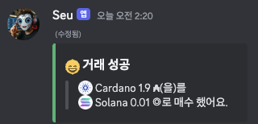

# Seu

***
> _**주식, 코인 거래 디스코드 봇의 미래**_
>  개발기간: 2024.04 ~
>  팀: <a href="github.com/AM-Incorporate">AM-Incopperate</a>
> (<a href="github.com/wheon06"> wheon06 </a>,
> <a href="github.com/ellystargram"> ellystargram </a>)

***

## 개발 환경

> OS : macOS
>  Languges : Java 22
>  Framework : Spring Boot 3
>  IDE : IntelliJ IDEA
>  Database : mySQL
***

## 종목 구성

 

***

## 기능

* 계정관리 명령어
    * `스우야 가입`: 스우봇 서비스에 가입할 수 있습니다.
    * `스우야 탈퇴`: 스우봇 서비스에서 탈퇴할 수 있습니다.
* 지갑관리 명령어
    * `스우야 지갑생성`: 지갑을 생성할 수 있습니다.
        * 영대소문자 6자리로 구성된 고유한 지갑주소를 갖습니다.
        * 지갑은 다음과 같은 플랜으로 선택하여 생성합니다.
            * Copper: 1배수
            * Bauxite: 2배수
            * Uranium: 3배수
    * `스우야 지갑조회`: 자신이 소지한 지갑정보를 간략하게 불러옵니다.
        * `스우야 지갑조회 {지갑주소}`: 해당 지갑주소에 무슨 코인이 들었는지 정밀하게 알려줍니다.
* 코인거래 명령어
    * `스우야 거래 {코인ID} {수량} {지갑주소}`: 코인을 거래할 수 있습니다.
        * 코인은 거래가능한 코인끼리만 거래가 가능합니다.
        * 코인을 구매할 수 있는 다른 코인은 시간마다 랜덤으로 바뀝니다.
        * 코인 거래량은 코인시장 변동에 영향을 줍니다.

***

## Working ScreenShots
**계정관리 기능**
 

 
**지갑관리 기능**
 

 
**코인거래 기능**
 

***

## 업데이트 계획

* 코인시장 GUI 제공
* 코인 이체 기능
* 코인 거래 MAX 기능
* 채굴기 컨텐츠 추가
